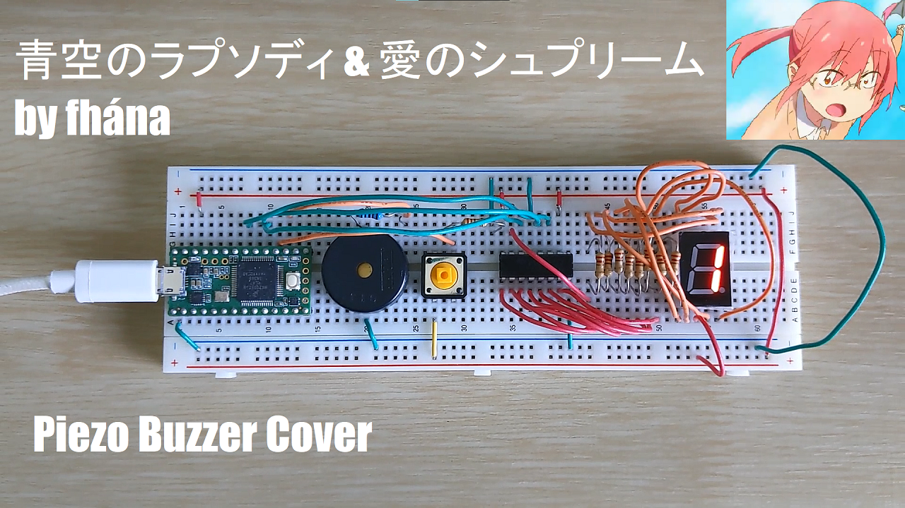
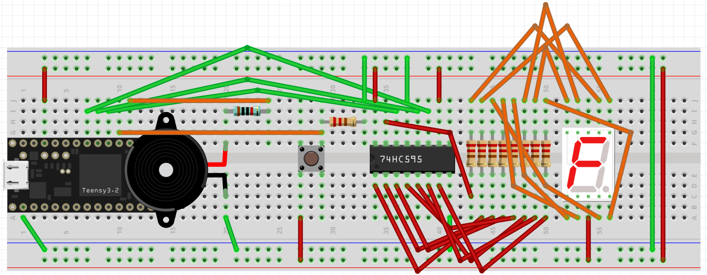
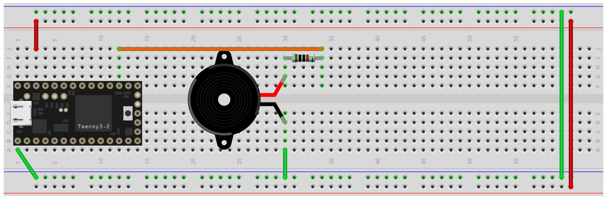
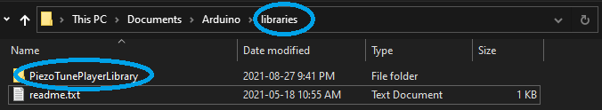

# Piezo Tune Player
Below you will find a video demonstration of the Piezo Tune Player featuring covers of the songs 青空のラプソディ and 愛のシュプリーム by fhána (short versions played during the openings for the anime *Miss Kobyashi's Dragon Maid* and *Miss Kobayshi's Dragon Maid S* respectively!

## Overview
This project creates a tune player by writing a sketch using Arduino programming language which plays a tune and outputs the sound to a piezo buzzer.
### Materials
The project uses the following components:
- Teensy 3.2 microcontroller
- Piezo Buzzer
- 10k Ω resistor
- Wires (various lengths)
- Breadboard (with conductive aluminum plating on the bottom)
### Software
The project uses the following software:
- [Arduino IDE](https://www.arduino.cc/en/Main/OldSoftwareReleases#previous) (Version 1.8.13)
- [Teensyduino add-on for Arduino IDE](https://www.pjrc.com/teensy/teensyduino.html)
- [Teensy Loader](https://www.pjrc.com/teensy/loader.html)
- [Fritzing](https://fritzing.org/)
### Circuit Layout History
The circuit designs are presented in two directories for convenience.
For viewing inside [Fritzing](https://fritzing.org/), refer to the 'fritzing' directory.
To simply see a .PNG of the circuit, refer to the 'images' directory.
### Version 2.0
The circuit design as of Saturday, September 04, 2021 is shown below:

#### Version 1.0
The circuit design as of Saturday, August 21, 2021 is shown below:  

## Running the Project
To run the project in Arduino IDE what you will need to do first is move the directory *PiezoTunePlayerLibrary* into the *libraries* directory for Arduino IDE as shown below:  
  
This is important because the PiezoTunePlayerLibrary contains all the content related to tunes used in the sketch.
## Playlist
The playlist of tunes available as of Tuesday, August 31, 2021 is shown below:
- 青空のラプソディ (Aozora no Rhapsody / Blue Sky Rhapsody / Miss Kobayshi's Dragon Maid Season 1 Opening) by fhána
- 愛のシュプリーム (Ai no Supreme / Love Supreme / Miss Kobayashi's Dragon Maid S Opening) by fhána  

Strictly speaking it is not included in the playlist but when the end of the playlist is reached, the *Game Over Theme* composed by Koji Kondo for the GameCube title *Super Mario Sunshine* is played.